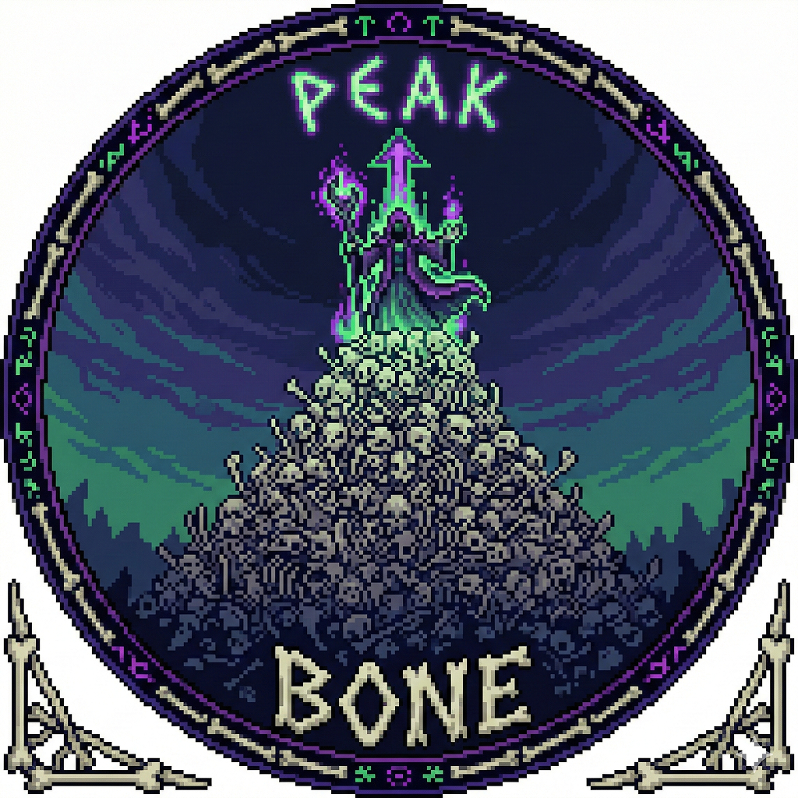

<div align="center">
  
</div>


# 🦴 Bone-To-Peak

> **"Everyone has a bone to pick, but we build a Bone to Peak."**

**Bone-To-Peak** is a dark-fantasy Bullet Heaven (Survivors-like) game where you don't just fight—you command. As a Necromancer, your strength isn't in your own hands, but in the rising tide of your undead legion. Rise from a lone survivor to the peak of the skeletal army.

---

## 💀 Game Overview

In a world that wants you dead, you make the dead work for you. **Bone-To-Peak** reimagines the classic survivor formula by focusing on **Minion Management** and **Tactical Summoning**.

* **Genre:** Action Roguelike / Bullet Heaven / Horde Survivor
* **Theme:** Dark Necromancy / Tactical Legion Building
* **Platform:** Steam (PC)

---

## 🗡️ Key Features

### 1. From Bone to Peak (Growth System)

Experience the exponential growth of your power. Start by reanimating a single ribcage and evolve into the Overlord of a thousand-man army. Every "bone" you collect brings you closer to the "peak" of necromantic evolution.

### 2. The Corpse Economy

Enemies aren't just obstacles; they are your primary resource. Use the fallen to:

* **Raise:** Summon various skeletons, zombies, and wraiths.
* **Refine:** Sacrifice weaker minions to empower your elite "Peak-Guardians."
* **Explode:** Use corpses as tactical traps to clear the screen.

### 3. Tactical Formations

Unlike traditional survivors where projectiles fly randomly, your minions react to your movement. Choose between **Defensive Phalanx**, **Aggressive Charge**, or **Circular Guard** to survive the onslaught.

---

## 🚀 Technical Highlights (For Developers)

* **Massive Unit Optimization:** Built using **Object Pooling** to handle hundreds of active minions and thousands of enemies simultaneously without frame drops.
* **Dynamic AI Pathfinding:** Light-weight flocking behavior for the undead horde.
* **Modular Skill System:** Easily expandable scriptable objects for diverse summoning combinations.

---

## 🛠️ Getting Started

### Prerequisites

* Unity 2022.3 LTS or higher (Recommended)
* Git LFS (For high-quality necro-assets)

### Installation

```bash
git clone https://github.com/dev-an/bone-to-peak.git
cd Bone-To-Peak

```

---

## 📜 License

This project is licensed under the MIT License - see the [LICENSE](https://www.google.com/search?q=LICENSE) file for details.

---

## 🧛 Author

**DEV.AN** - *Lead Necromancer*

*"The graveyard is just a waiting room for my army."*
